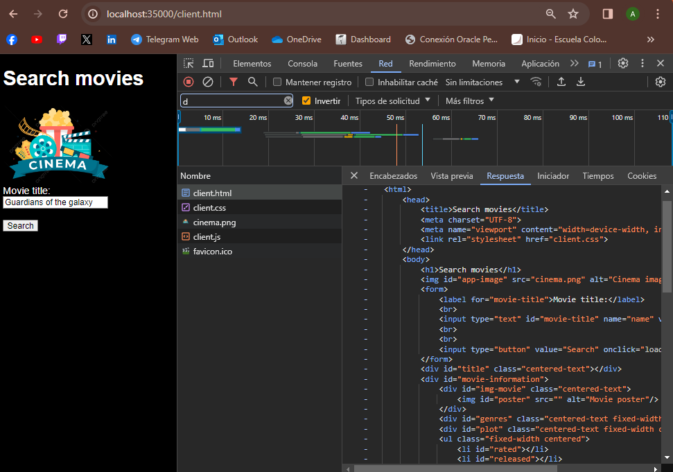
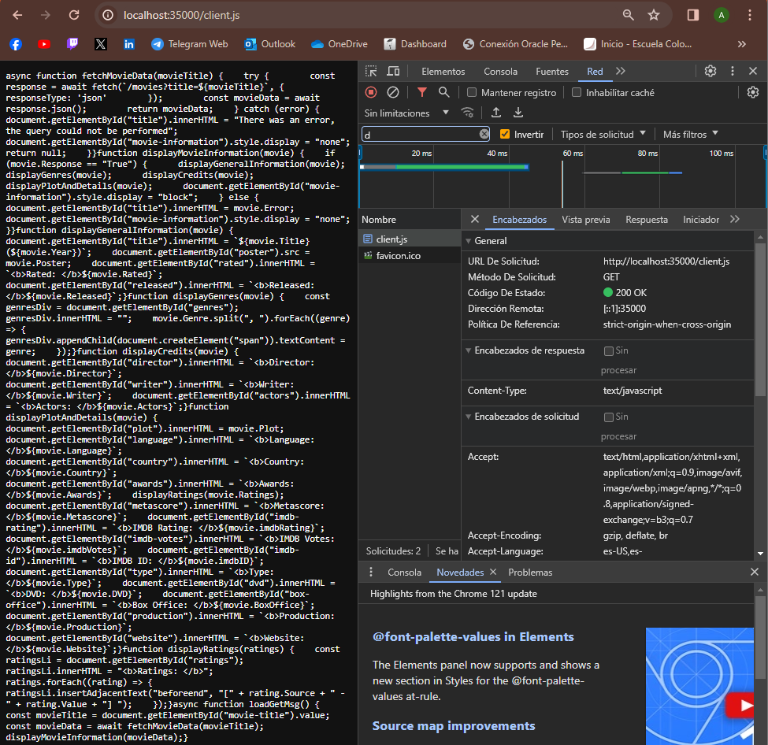
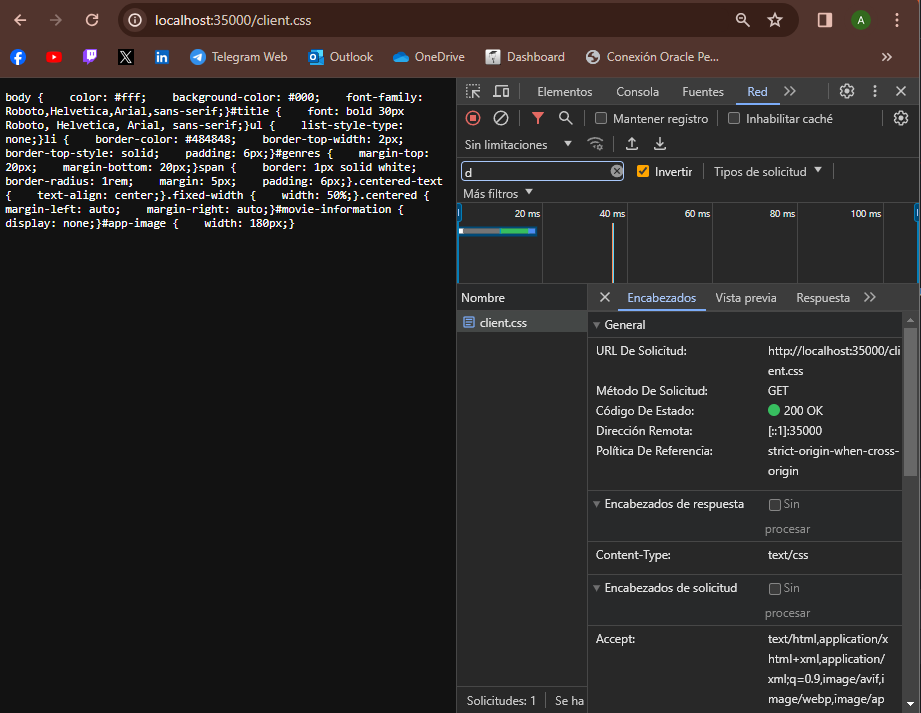
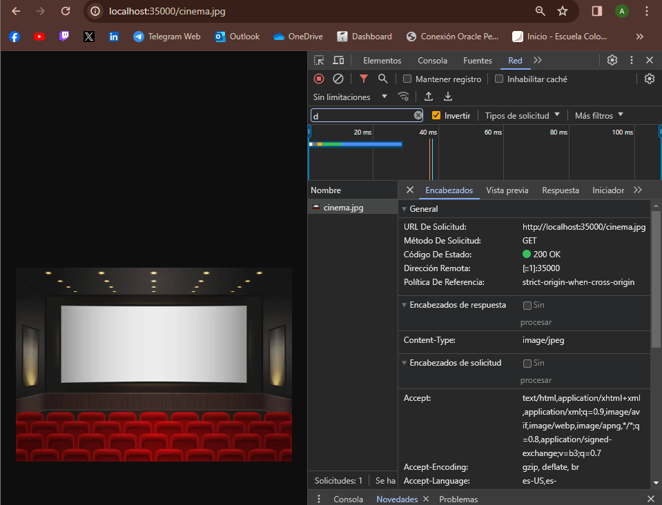
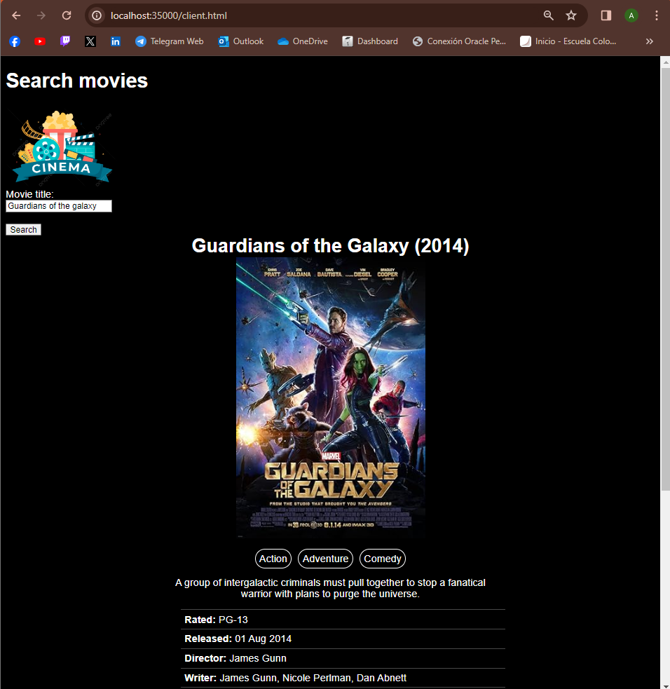

# TALLER 2: DISEÑO Y ESTRUCTURACIÓN DE APLICACIONES DISTRIBUIDAS EN INTERNET

Servidor web que soporta múltiples solicitudes seguidas (no concurrentes). El servidor lee los archivos del disco local y retornar todos los archivos solicitados, incluyendo páginas html, archivos java script, css e imágenes.

## Comenzando

Estas instrucciones te ayudarán a obtener una copia del proyecto en funcionamiento en tu máquina local para fines de desarrollo y pruebas.

### Requisitos previos

- Kit de desarrollo de Java (JDK) versión 11 o posterior
- Herramienta de construcción Maven

### Instalando

1. Clona el repositorio:
    ```
    git clone https://github.com/AlexisGR117/AREP-TALLER2.git
    ```
2. Navega a la carpeta del proyecto:
    ```
    cd AREP-TALLER2
    ```
3. Construye el proyecto usando Maven:
    ```
    mvn clean install
    ```
4.  Ejecuta la aplicación:
    ```
    java -cp target/AREP-TALLER2-1.0-SNAPSHOT.jar edu.escuelaing.arep.MovieInfoServer
    ```
5. Abre un navegador web y accede a la aplicación en http://localhost:35000/client.html.
## Ejecutando las pruebas

Ejecuta las pruebas unitarias:
    ```
    mvn test
    ```

## Documentación

Para generar el Javadoc (se generará en la carpeta target/site):
    ```
    mvn site
    ```

## Arquitectura

La arquitectura del prototipo es una arquitectura simple de cliente-servidor. El cliente es una aplicación web escrita en HTML, CSS y JavaScript. El servidor es una aplicación Java que escucha las solicitudes del cliente y envía respuestas.

El cliente realiza una solicitud al servidor para un recurso específico, como un archivo HTML, un archivo CSS o una imagen. El servidor localiza el recurso solicitado en el disco local y lo envía al cliente. El cliente luego renderiza el recurso en el navegador.

El servidor también incluye una API REST que el cliente puede usar para obtener información de películas de la API OMDb. Cuando el cliente realiza una solicitud a la API REST, el servidor busca la información de la película en la API OMDb y la envía al cliente. El cliente luego muestra la información de la película en la pantalla.

## Evaluación

### Caso de prueba 1:

**Objetivo:** Verificar que el servidor entrega correctamente archivos HTML.

**Entrada:** Solicitud al servidor para un archivo HTML.

**Salida:** El cliente debe mostrar el archivo correctamente, sin errores de carga o visualización.



Se realizó la petición a http://localhost:35000/client.html la cual obtuvo como respuesta exitosa el archivo html, que a su vez hace la petición a los demás archivos que se requieren para mostrar la aplicación.

### Caso de prueba 2:

**Objetivo:** Verificar que el servidor entrega correctamente archivos Javascript.

**Entrada:** Solicitud al servidor para un archivo Javascript.

**Salida:** El cliente debe mostrar el archivo correctamente, sin errores de carga o visualización.



Se realizó la petición a http://localhost:35000/client.js la cual obtuvo como respuesta exitosa el archivo js.

### Caso de prueba 3:

**Objetivo:** Verificar que el servidor entrega correctamente archivos CSS.

**Entrada:** Solicitud al servidor para un archivo CSS.

**Salida:** El cliente debe mostrar el archivo correctamente, sin errores de carga o visualización.



Se realizó la petición a http://localhost:35000/client.css la cual obtuvo como respuesta exitosa el archivo css.

### Caso de prueba 4:

**Objetivo:** Verificar que el servidor entrega correctamente imágenes.

**Entrada:** Solicitud al servidor para una imagen.

**Salida:** El cliente debe mostrar la imagen correctamente, sin errores de carga o visualización.



Se realizó la petición a http://localhost:35000/cinema.jpg la cual obtuvo como respuesta exitosa la imagen.

### Caso de prueba 5:

**Objetivo:** Verificar que el cliente puede mostrar la información de la película correctamente.

**Entrada:** Una solicitud al servidor para la película "Guardians of the galaxy".

**Salida:** El cliente debe mostrar la información de la película correctamente, sin errores de carga o visualización.



Se realizó la petición a http://localhost:35000/client.html se ingreso el nombre de la película y se oprimió el botón "search" para obtener la información de la película, se mostró la información con éxito.

## Construido con

- Java 11
- Maven

## Autores

* Jefer Alexis Gonzalez Romero
